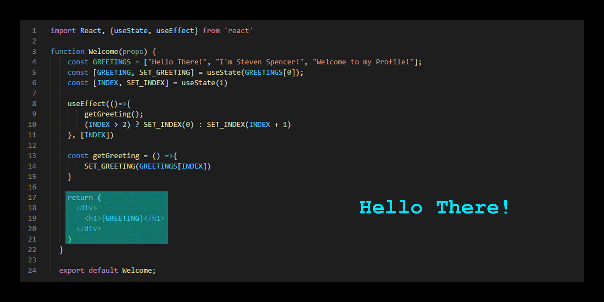

### Hi there 👋

Welcome to my Profile! I am Steven Spencer, a Team Lead and Student at Lambda School!
I'm from Worcester Massachusetts and spend most of my time either programming, working on cars, or listening to music!

Most of my programming work is in React, CSS, and NodeJS, however I also have knowledge in HTML, Native JavaScript, Java, and Python, and I also know how to use LESS, Styled Components, Reactstrap, Bootstrap, Redux, and Context API.

You can find my portfolio website at https://stevenspencer.info, or you can get in touch with me directly at steve35spencer@gmail.com
